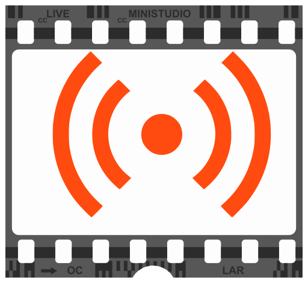

#  Smart & live

What is MiniStudio™?
--------------------

MiniStudio™ Is a personal "live streaming" app that I made because I didn't find any that suited me. One day it might become useful to others.

What features does MiniStudio™ have?
--------------------------------

MiniStudio™ Is ultimately tailored to my exact needs;
 * I can control it using my ancient Tascam 428 USB mini control
 * I can route video from HDMI inputs, webcams, screen capture and other sources
 * I can composit, mix and add captions/vignettes/effects in real time
 * I can experiment with new ways of presenting
 
Where can I download?
---------------------

Currently there are no downloads. Build from source.
NOTE: This will be hard to build outside my exact setup. YMMV

Where can I get help &amp; documentation?
-----------------------------------------

What? NO.

How can I help?
---------------

If you feel like it, try to normalize the project so it builds on other systems than mine. But sriously.
